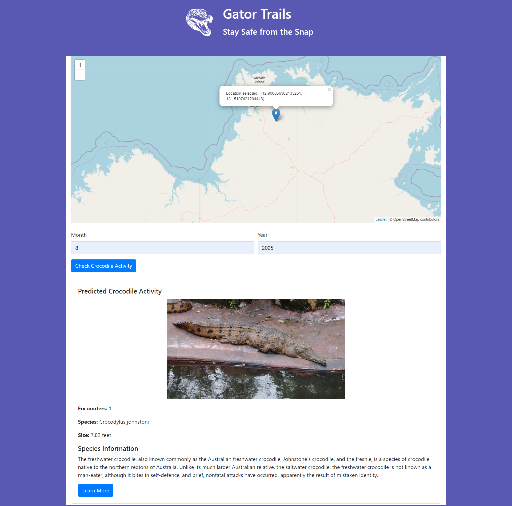
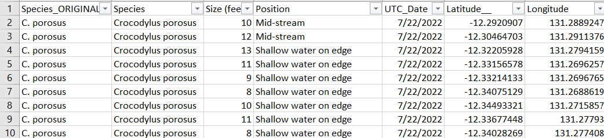

# GatorTrails - Crocodile Activity Predictor

### Overview

**GatorTrails** is a web application built using Flask that allows users to predict crocodile encounters based on location and time. The app offers a user-friendly interface where users can click on a map to select a location, specify a month and year, and then receive predictions for the likelihood of crocodile encounters, estimated size of the crocodile, and species information. Additionally, the app integrates with Wikipedia to provide further details about the predicted crocodile species.



### Key Features

- **Map-Based Interaction**: Users can easily select a location by clicking on a map, making the process intuitive and accessible.
- **Crocodile Predictions**: The app uses machine learning models to predict the number of crocodile encounters, the species, and the size of the crocodile.
- **Species Information**: The app fetches additional information about the predicted crocodile species from Wikipedia, giving users a comprehensive view.
- **Responsive Design**: Built using Bootstrap, the app is responsive and works across different devices.

---

## Background

The Northern Territory of Australia is known for its rich wildlife, including a significant population of saltwater crocodiles. This app aims to help residents and tourists predict potential crocodile encounters in specific areas, promoting awareness and safety. The application utilizes historical data on crocodile encounters to provide predictions based on location and time.

---

### Dataset Snapshot



### Data Preprocessing & Engineering

Before building the machine learning models, we needed to clean and transform the raw crocodile survey data to make it suitable for analysis and prediction. Here's a step-by-step breakdown of the data preprocessing workflow:

#### 1. Loading the Dataset
- The dataset was stored in an Excel file containing details about crocodile sightings, including location, species, size, and the time of the encounter.
- We loaded this dataset into a Pandas DataFrame for easier manipulation and analysis.

#### 2. Extracting Date, Month, and Year
- The dataset contained a `UTC_Date` column that recorded the exact date and time of each encounter.
- To simplify time-based analysis and prediction, we extracted the **Date**, **Month**, and **Year** from this column and created separate columns for each.

#### 3. Rounding Latitude and Longitude
- Exact latitude and longitude coordinates can be overly specific and may introduce unnecessary noise into the analysis.
- We rounded these values to three decimal places to group nearby encounters more effectively, which improved the predictions.

#### 4. Grouping Data by Location and Time
- The data was grouped by **Latitude**, **Longitude**, **Date**, **Month**, and **Year** to aggregate information at each unique location and time combination.
- For each group, we extracted the first recorded **species** and calculated the **average size** of the crocodiles (in feet).

#### 5. Counting the Number of Encounters
- A column was created to count the number of encounters at each location and time.
- This value was crucial for predicting the likelihood of future crocodile encounters in that area.

#### 6. Saving the Preprocessed Data
- Once the data was cleaned, grouped, and enriched with insights (such as the number of encounters, species, and average size), we saved the preprocessed data to a CSV file.
- This data was then used for training machine learning models and performing further analysis.

#### 7. Final Inspection
- After preprocessing, we reviewed the data to ensure that the transformations were applied correctly and that the data was in the appropriate format for analysis.

### Summary of Data Preprocessing

- **Raw Data**: The original dataset contained detailed records of crocodile sightings, including timestamps, location, species, and size.
- **Date, Month, and Year Extraction**: We extracted the date, month, and year from the timestamp to make time-based analysis easier.
- **Latitude and Longitude Rounding**: The latitude and longitude coordinates were rounded to three decimal places to group nearby sightings effectively.
- **Data Grouping**: The data was grouped by location (latitude, longitude) and time (date, month, year) to aggregate information about species and size.
- **Encounter Count**: A column was created to count the number of encounters at each location and time.
- **Preprocessed Data**: The cleaned and transformed data was saved to a CSV file, ready for further analysis and model training.

---

## Machine Learning Models

We used three machine learning models to make predictions:
1. **Encounter Prediction Model**: This model predicts the number of crocodile encounters for a given location and time.
2. **Species Prediction Model**: This classification model predicts the species of the crocodile most likely to be encountered based on location and time.
3. **Size Prediction Model**: This model predicts the average size of the crocodile at the selected location and time.

The models were trained using the preprocessed data, and the predictions are made in real-time when the user selects a location and provides a month and year.

---

## How It Works

1. **Select a Location**: Users interact with an interactive map where they can click on a location of interest.
2. **Input Date**: Users specify the month and year for which they want predictions.
3. **View Predictions**: The app uses pre-trained machine learning models to predict the likelihood of encountering crocodiles, the species, and their size. Additional species information is fetched from Wikipedia for a richer user experience.

---

## Running the Project

### Prerequisites

To run this project locally, you need:
- **Python 3.x**
- **Flask** installed on your machine
- The necessary dependencies listed in `requirements.txt`

### Steps

1. Clone the repository:
   ```bash
   git clone https://github.com/akd6203/gatortrails.git
   cd gatortrails
2. Set up a virtual environment:
  python3 -m venv venv
  source venv/bin/activate    # On Windows: venv\Scripts\activate
3. Install the dependencies:
   pip install -r requirements.txt
4. Run the Flask application:
   flask run
The app will be available at http://127.0.0.1:5000/

### Contributing

Contributions are welcome! If you find any issues or have ideas for improvement, feel free to submit a pull request or open an issue. Happy Coding!!!
